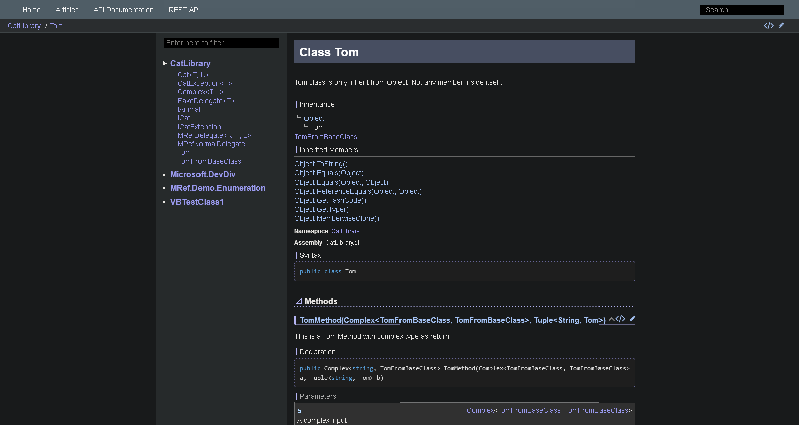

# docfx-lavandula
A minimalist DocFX template. Based on [MathewSachin/docfx-tmpl](https://github.com/MathewSachin/docfx-tmpl).



## Usage

In docfx.json:

```json
{
    "build": {
        "template": [
            "default",
            "docfx-lavandula/src"
        ]
    }
}
```

With the command line:

```
docfx -t default,docfx-lavandula/src
```
